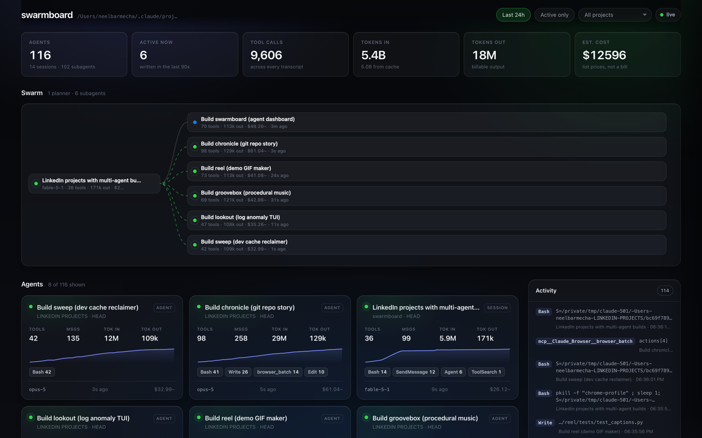

# swarmboard

**Watch your Claude Code agent swarm work, live, from the transcripts already on your disk.**



## Why

When you fan a Claude Code session out into six parallel subagents, you lose the thing you
most want: a view of what they are all doing. The terminal shows you one stream. The other
five are off somewhere, writing files, running builds, burning tokens.

They are not actually invisible. Claude Code already writes every session to disk as JSONL
at `~/.claude/projects/<encoded-project>/<sessionId>.jsonl`, and every subagent to
`<sessionId>/subagents/agent-<agentId>.jsonl` next to it. That is a complete, structured,
append-only event log of the whole swarm — it just has no face.

swarmboard is the face. It tails those files by byte offset, reconstructs the parent →
subagent tree from the `.meta.json` sidecars, and streams the result to a local dashboard
over Server-Sent Events. No agent framework, no instrumentation, no wrapper around your
workflow. You keep working exactly as you do now and the board fills in.

## 60-second quickstart

Needs Node 22 or newer.

```bash
git clone https://github.com/neelbarm/swarmboard && cd swarmboard
npm install
npm run build
npm start
```

Then open **http://localhost:4141**.

That reads your real `~/.claude/projects`. Start a Claude Code session in another terminal
and watch the card appear.

### Demo mode

```bash
npm run demo
```

Serves a bundled, entirely synthetic `fixtures/` tree — a planner that fanned out to three
subagents, one finished and two still running — so you can screenshot the dashboard without
putting your own prompts on the internet. The header shows a `demo fixtures` badge so it is
never mistaken for live data.

## What you get

- **Agent cards** — project, model, status, message and tool-call counts, tokens in/out/cache,
  an estimated cost, and a hand-rolled SVG sparkline of output tokens over time.
- **Swarm view** — the parent session and everything it spawned, with live status dots and
  animated edges, so a six-way fan-out is obvious at a glance.
- **Per-agent detail** — a timeline of every tool call with the command or file path it used,
  a deduplicated list of files touched with counts, and the latest assistant message.
- **Activity feed** — tool calls across every agent, newest first, to a depth of 200.
- **Filters** — last 24 hours (on by default, because a laptop accumulates months of
  transcripts), active only, and by project.

Status is derived honestly: **active** means the transcript file was written in the last 90
seconds; **finished** means the parent session has recorded a `tool_result` for the
`tool_use` that spawned that subagent; **idle** is everything else.

## How it works

**Incremental tailing.** Each transcript is tracked with a byte offset. On every change the
store reads only `[offset, size)`, splits on newlines, and holds any trailing fragment until
the rest of the line lands — a transcript is often caught mid-write. Re-reading a 400KB file
because one line was appended would be the obvious way to do this, and it is wrong: the cost
grows with history instead of with news. If a file shrinks it is treated as rewritten and
replayed from zero.

**Session tree reconstruction.** Subagent transcripts carry the *parent's* `sessionId` plus
their own `agentId`, and their `agent-<id>.meta.json` sidecar carries the `toolUseId` of the
`Agent` tool call that created them. That is enough to rebuild the tree and to tell a running
agent from one that has already reported back.

**Tolerant parsing.** Line types seen in the wild include `user`, `assistant`, `attachment`,
`system`, `custom-title`, `ai-title`, `last-prompt`, `mode`, `queue-operation`,
`file-history-snapshot` and several more, and the set grows with each release. Anything
unrecognised is skipped, as is any line that fails to parse. A malformed line never takes
down a session, let alone the server.

**Live updates.** `fs.watch` on the projects directory (recursive, with a 2-second polling
pass as a fallback for filesystems that do not support it), debounced, feeding a Server-Sent
Events stream. The browser patches the DOM against keyed maps rather than re-rendering, so
values animate between states instead of flickering.

## CLI

```
swarmboard [--dir <path>] [--port <n>]      start the dashboard (default http://localhost:4141)
swarmboard stats [options]                  print a session table and exit
swarmboard --demo                           serve the bundled synthetic fixtures

  -d, --dir <path>      projects directory to read (default ~/.claude/projects)
  -p, --port <n>        port for the dashboard (default 4141)
      --demo            read the bundled fixtures instead of your real sessions
      --since <dur>     stats: only sessions active within 24h / 90m / 7d
      --all             stats: no time cutoff
      --project <sub>   stats: filter by project name substring
      --active          stats: only sessions written in the last 90s
      --limit <n>       stats: max rows (default 50)
  -h, --help            this text
  -v, --version         print the version
```

```console
$ swarmboard stats --since 6h
swarmboard /Users/you/.claude/projects
7 shown · 6 active · 14 sessions · 102 subagents

AGENT                                        STATUS  PROJECT            MODEL      TOOLS  TOP TOOLS                TOK IN  TOK OUT   COST~  LAST
───────────────────────────────────────────  ──────  ─────────────────  ─────────  ─────  ───────────────────────  ──────  ───────  ──────  ────
○ LinkedIn projects with multi-agent builds  idle    LINKEDIN PROJECTS  fable-5-1     19  Bash:6 Agent:6            2.8M   146.7k  $19.12    4m
● └─ Build swarmboard (agent dashboard)      active  LINKEDIN PROJECTS  opus-5        27  Bash:17 Write:8 Read:2    4.4M    43.8k  $15.21     5s
● └─ Build chronicle (git repo story)        active  LINKEDIN PROJECTS  opus-5        21  Write:13 Bash:6 Edit:2    2.4M    39.2k   $9.20    30s
```

## Costs are estimates

swarmboard ships a small table of published list prices and applies the standard cache
multipliers (writes at 1.25x input, reads at 0.1x). Prices change, your plan may not bill
per token at all, and unknown models fall back to mid-tier rates. Every cost in the UI and
the CLI is labelled as an estimate. Treat it as a sense of scale, not an invoice.

## Privacy

Everything stays on your machine. swarmboard reads files under `~/.claude/projects`, serves
a dashboard on `127.0.0.1`, and makes no outbound network requests of any kind — there is no
telemetry, no analytics, no CDN, no webfont fetch, and no API key required or used. The demo
fixtures are synthetic text generated by this repo, so screenshots never leak a real prompt.

## Development

```bash
npm run build     # tsc, strict, to dist/
npm test          # build, then node:test over dist/test
npm run fixtures  # regenerate fixtures/
npm run stats     # the CLI table against your real sessions
```

Zero runtime dependencies. TypeScript and `@types/node` are the only devDependencies. The
dashboard is one HTML file, one CSS file and one JS module — no framework, no bundler.

## License

MIT. See [LICENSE](LICENSE).

---

Planned by Claude Fable 5.1, built by a Claude Opus agent in one evening with Claude Code.
